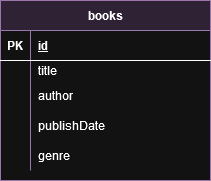

<p align="center">

<a  href="http://nestjs.com/"  target="blank"></a>

</p>

  
  

## UML diagram

  



  
  

## Description

  

[Nest](https://github.com/nestjs/nest) framework TypeScript starter repository.

  

## Project setup

  

```bash

$  npm  install

```

  

## Compile and run the project

  

```bash

# development

$  npm  run  start

  

# watch mode

$  npm  run  start:dev

  

# production mode

$  npm  run  start:prod

```

  

## Run tests

  

```bash

# unit tests

$  npm  run  test

  

# e2e tests

$  npm  run  test:e2e

  

# test coverage

$  npm  run  test:cov

```

  

## Running the Application with Docker

  

This project includes a `docker-compose.yml` file that sets up the necessary services to run the NestJS application along with MongoDB. Below are the steps to run the application using Docker.

  

### Requirements

  

Make sure you have Docker and Docker Compose installed on your machine.

  

### Steps to Run the Application

  

1.  **Build and Start the Containers**:

  

Run the following command in the root of your project, where the `docker-compose.yml` file is located:

  

```bash

docker-compose up --build

```

### This command will do the following:

  
Build the application image.

Start the MongoDB container.

Start the NestJS application container.

  

Access the Application:

  

Once the containers are up and running, you can access your application at the following link:

  
  
```bash
http://localhost:3000
```
  

Useful Commands


To run the containers in the background, use the following command:
```bash
docker-compose up -d
```

To stop the containers, run:

  

```bash
docker-compose  down
```

Structure of the docker-compose.yml File

  

The docker-compose.yml file looks like this:

  
  

```yaml

version:  '3.8'

services:

mongodb:

image:  mongo:latest

container_name:  mongodb

ports:

- "27017:27017"

volumes:

- mongo-data:/data/db
app:

build:  .

container_name:  nest_js_app

ports:

- "3000:3000"

environment:

- MONGO_URL=mongodb://mongodb:27017/library

depends_on:

- mongodb
volumes:

mongo-data:

```

### Description of Services

  

mongodb: Container running MongoDB, mapping port 27017, and using a persistent volume.

app: Container for the NestJS application, built from the Dockerfile, exposing port 3000. It uses the MONGO_URL environment variable to connect to the database.

  

## License

  

Nest is [MIT licensed](https://github.com/nestjs/nest/blob/master/LICENSE).
